# 第二阶段运行效果图

以下截图为第二阶段成品实际运行画面（1600×900，file:// 双击运行），采集脚本见仓库根目录 `shots2.cjs`（系统 Edge 无头通道，零 JS 错误）。

第二阶段内容：城外现代城区（正定新区 CBD、滨河社区、北部居住区）、滹沱河双塔双索面斜拉桥、燕赵老街与南关古镇文化街区、游客服务中心与博物馆、凌霄塔木构外观重做、核心古迹实景照片面板、长乐门出行交通图、河北文旅标语。

## 〇、启动页

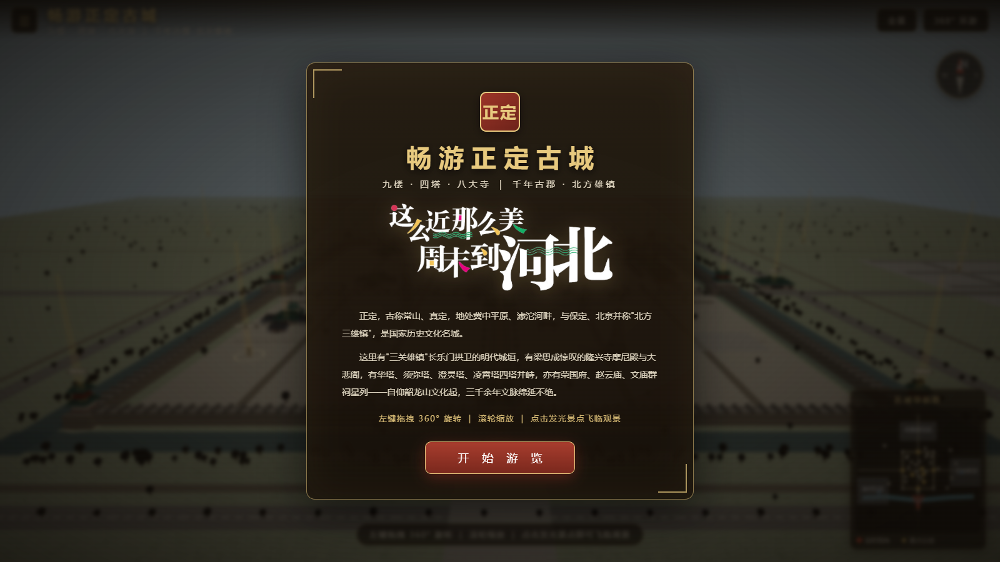

启动页加入河北文旅官方标语「这么近，那么美，周末到河北」logo（灰底抠除为透明 PNG，与深色古风卡片融合）。

## 一、古今交融全城

| | |
| --- | --- |
| 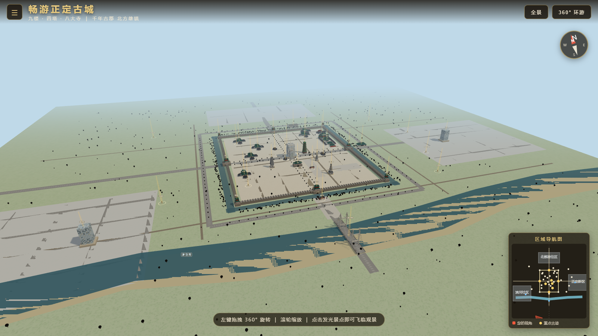 | 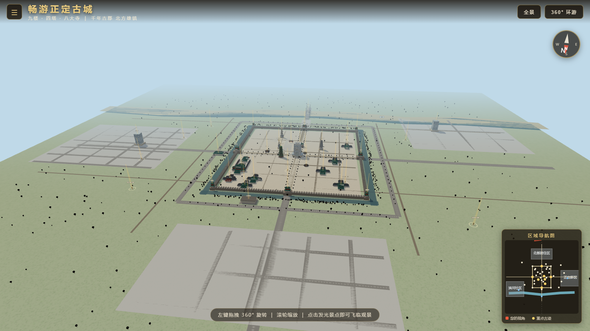 |
| 南望：古城中轴南延，南关古镇、斜拉桥与东部新区同框 | 北望：古城、博物馆与北部现代居住组团相映 |

## 二、现代城区

| | |
| --- | --- |
| 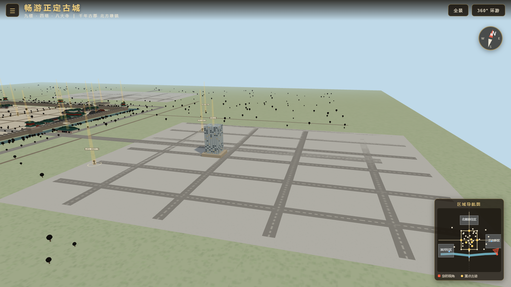 | 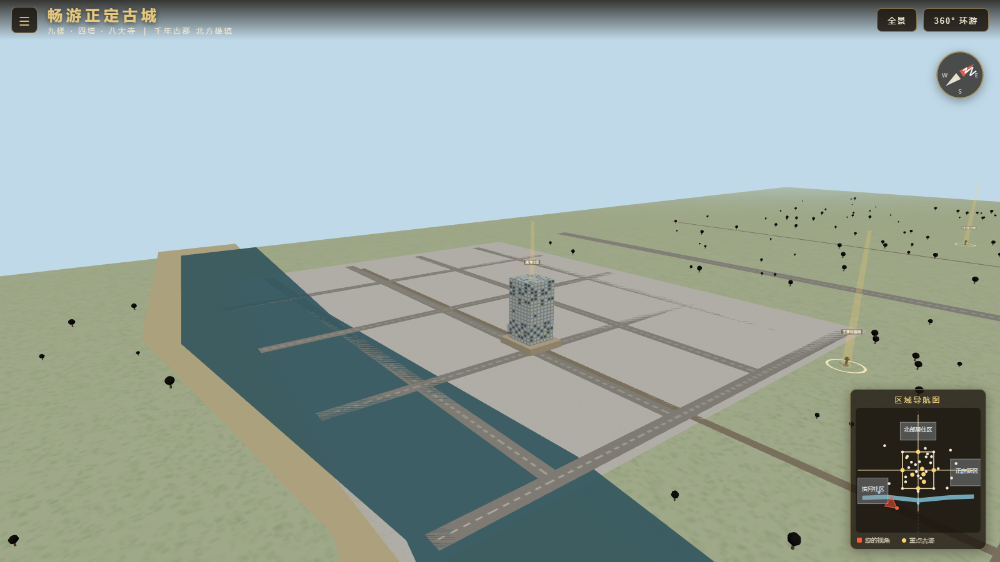 |
| 正定新区：玻璃幕墙商务楼群与网格路网 | 滨河社区：滹沱河西岸板式居民楼 |

## 三、滹沱河大桥

| | |
| --- | --- |
| 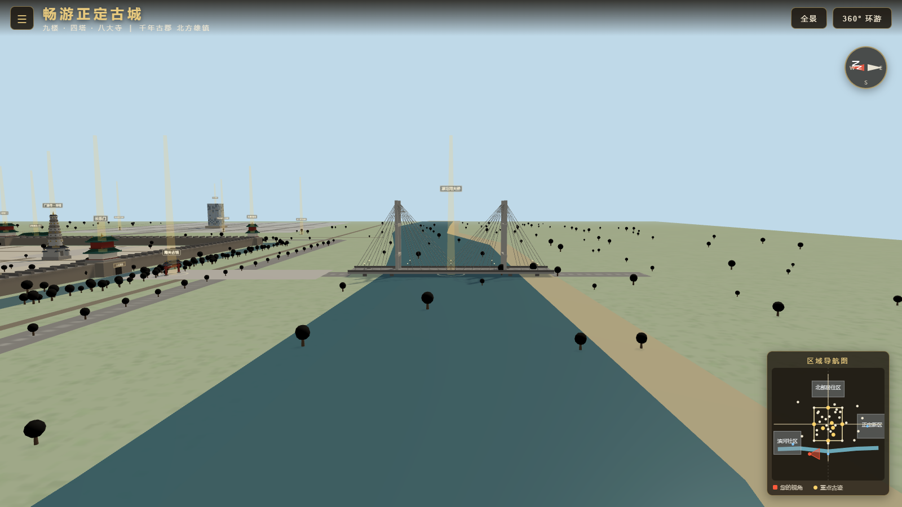 | 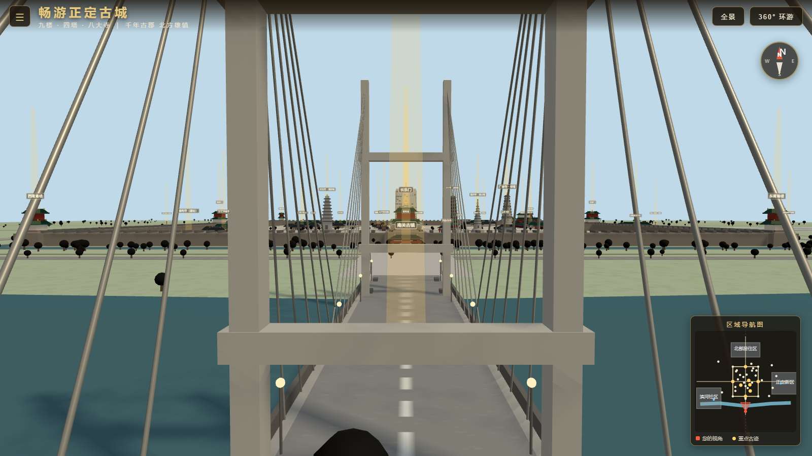 |
| 双塔双索面斜拉桥，斜索如扇横跨滹沱河 | 桥面北望：中轴直对长乐门城楼，古今交汇 |

## 四、文化街区与服务设施

| | |
| --- | --- |
| 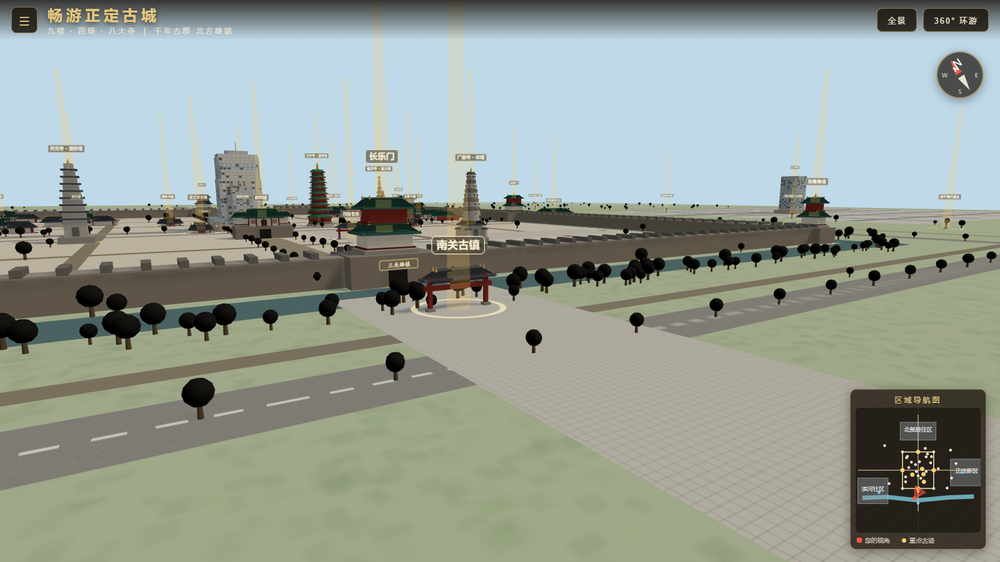 | 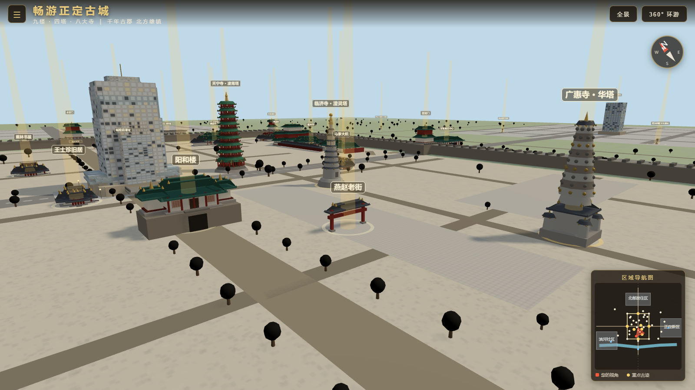 |
| 南关古镇：长乐门外关厢商埠牌坊 | 燕赵老街：青砖二层铺面沿街排开 |
| 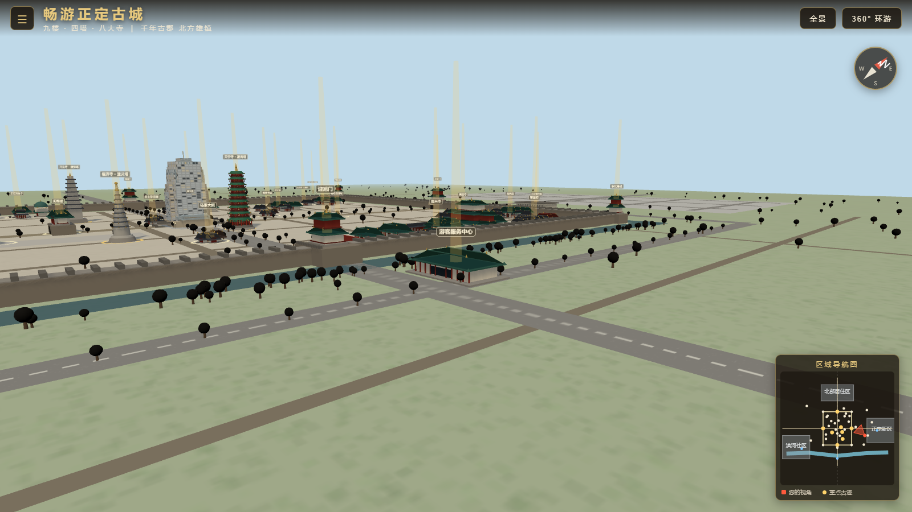 | 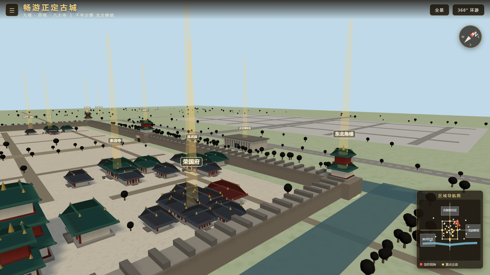 |
| 迎旭门外新中式游客服务中心 | 古城北侧正定博物馆（石材+玻璃） |

## 五、古建精修

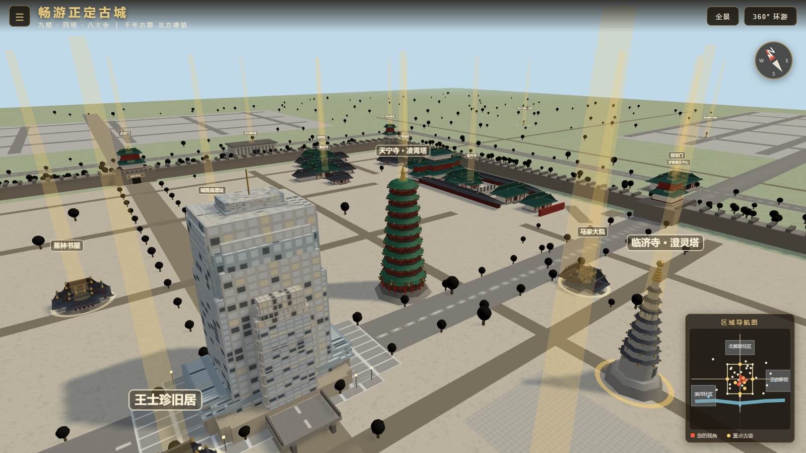

天宁寺凌霄塔木构外观重做：红色木构塔身、绿色琉璃瓦与金色塔刹，再现四塔最高之木塔。

## 六、图文面板

| | |
| --- | --- |
| 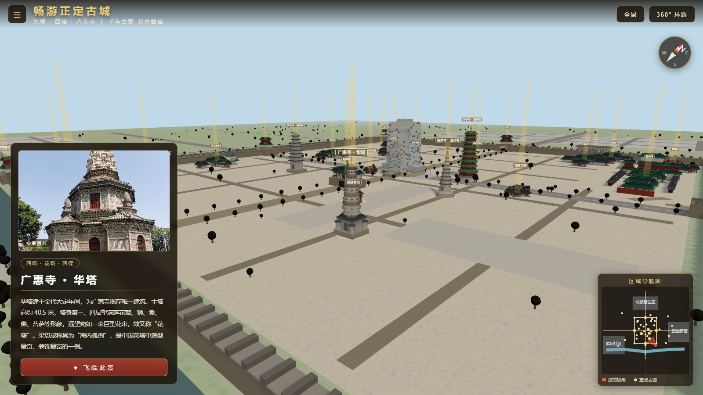 | 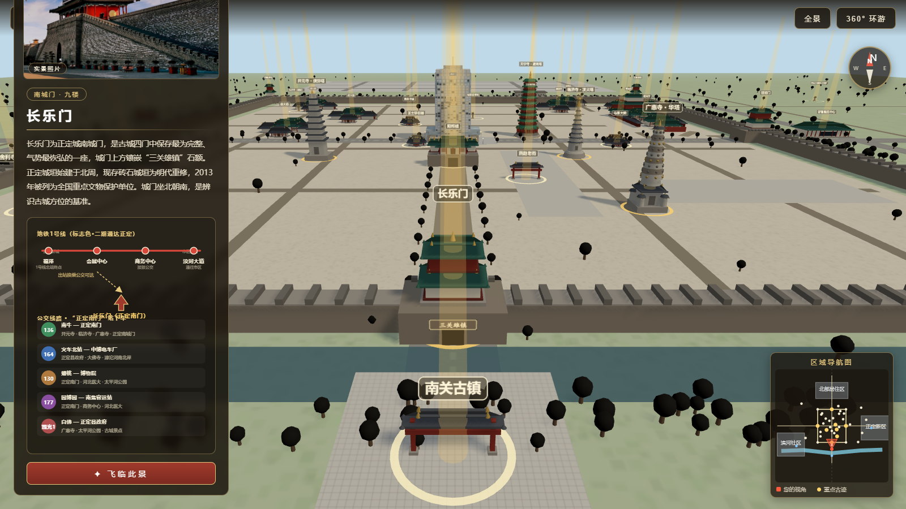 |
| 核心古迹简介面板配实景照片 | 长乐门面版含公交线路出行交通图 |

## 采集方式

```bash
# 先构建 dist/app.js，再用系统 Edge 无头截图
npm install
npm run build
node shots2.cjs
```
